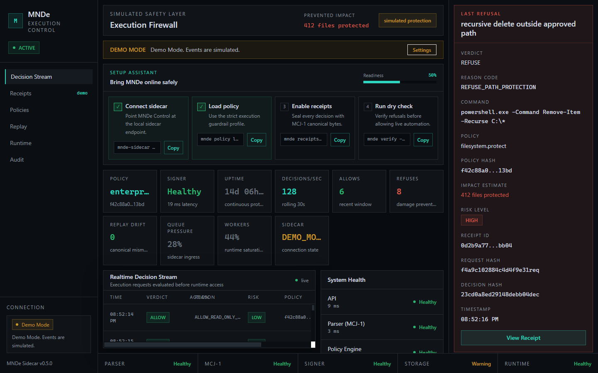

# MNDe Sidecar UI: Simple How-To



## What This App Is

MNDe Sidecar UI is the operator screen for an execution firewall. Its job is to show whether MNDe is alive, whether it is protecting execution, what it allowed, what it refused, and what proof was produced.

The most important product signal is the **Last Refusal** panel on the right. That is where you see what MNDe stopped before damage happened.

## Start The UI

From the app folder:

```powershell
cd C:\Users\Shadow\Downloads\INsol\mnde-sidecar-ui
cmd /c npm run dev
```

Open:

```text
http://127.0.0.1:1420/
```

For desktop mode:

```powershell
cmd /c npm run tauri -- dev
```

## Use Demo Mode

Demo Mode is for showing the product when no sidecar is running.

In Demo Mode:

- events are simulated
- receipts are simulated
- refusals are simulated
- the UI clearly says `DEMO MODE`

Use Demo Mode to explain the product story:

```text
MNDe prevented an unsafe action before damage occurred.
```

Examples shown in Demo Mode include:

- recursive delete blocked
- unsigned outbound binary blocked
- retry storm prevented
- signer latency warning
- replay check passed
- files protected
- estimated spend avoided

## Use Live Mode

Live Mode connects to a real MNDe sidecar at:

```text
http://127.0.0.1:8787
```

The UI tries these endpoints:

```text
GET  /healthz
GET  /readyz
GET  /metrics
GET  /receipts/recent?limit=50
POST /receipts/verify
```

Live Mode only reports sidecar data. If the sidecar is unavailable, the UI says:

```text
MNDe sidecar disconnected.
No live protection status available.
```

## Read The Screen

### Left Sidebar

Shows:

- MNDe branding
- current system state
- navigation
- connection state
- sidecar version

### Top Header

Shows whether you are in Demo Mode or Live Mode and whether MNDe is connected.

### Setup Assistant

Use this to understand the safe startup sequence:

1. Connect sidecar
2. Load policy
3. Enable receipts
4. Run dry check

The copy buttons copy example commands.

### Status Cards

Shows operational health:

- policy name
- policy hash
- signer status
- signer latency
- uptime
- decisions/sec
- allows
- refuses
- replay drift
- queue pressure
- worker saturation
- sidecar state

### Decision Stream

This is the live feed.

Each row shows:

- timestamp
- verdict
- action
- reason code
- risk
- policy hash
- receipt id

Click a receipt id to open details.

### Last Refusal Panel

This is the most important panel.

It shows:

- refused action
- reason code
- command preview
- policy
- policy hash
- impact estimate
- risk level
- receipt id
- request hash
- decision hash
- timestamp

This panel answers:

```text
What did MNDe stop, and why did it matter?
```

### Receipt Detail

Open receipt detail by clicking a receipt.

It shows:

- receipt id
- timestamp
- verdict
- reason code
- request hash
- decision hash
- policy hash
- canonical payload hash
- signature status
- replay status
- policy source
- raw receipt JSON

Actions:

- copy receipt
- copy receipt id
- copy hashes
- export JSON
- verify receipt

## Settings

Click **Settings** in the mode banner.

Settings include:

- Demo Mode or Live Mode
- sidecar endpoint
- poll interval
- request timeout
- receipt limit
- native notifications
- auto reconnect
- demo event rate

Settings are saved locally in the browser.

## Logs

The logs panel shows:

- connection events
- API errors
- receipt verification logs
- signer warnings
- runtime warnings
- disconnect events

You can:

- search logs
- filter severity
- clear logs

## What The States Mean

### DEMO MODE

The UI is simulated. Good for demos and screenshots.

### CONNECTED

The sidecar is reachable and live telemetry is available.

### DEGRADED

Some sidecar endpoints are unavailable or warning.

### REFUSING

MNDe recently refused an unsafe action.

### DISCONNECTED

The sidecar is not reachable. The UI does not claim live protection.

### UNSUPPORTED_ENDPOINT

The sidecar is reachable, but an endpoint is missing or not implemented yet.

## System As A Whole

MNDe has three layers:

1. **MCJ-1 deterministic JSON**
   - creates canonical bytes
   - rejects ambiguous JSON
   - supports stable hashes and receipts

2. **MNDe sidecar**
   - evaluates execution requests
   - applies policy
   - allows or refuses actions
   - writes receipts

3. **MNDe Sidecar UI**
   - shows the operator what happened
   - highlights dangerous actions stopped
   - opens receipts
   - verifies proof when the endpoint exists

## Fastest Demo Script

1. Open the UI.
2. Confirm it says `DEMO MODE`.
3. Point to **Last Refusal**.
4. Say: “MNDe stopped this before damage occurred.”
5. Point to **Impact Estimate**.
6. Point to **Receipt ID**.
7. Click a receipt.
8. Show hashes and raw receipt JSON.
9. Open Settings.
10. Explain Live Mode connects to the real sidecar at `127.0.0.1:8787`.

## Production Checklist

Before production use, wire:

- real sidecar endpoints
- real receipt schema
- signed receipt verification
- native notifications
- tray/minimize behavior
- auth/trusted local transport
- audit retention
- installer packaging
